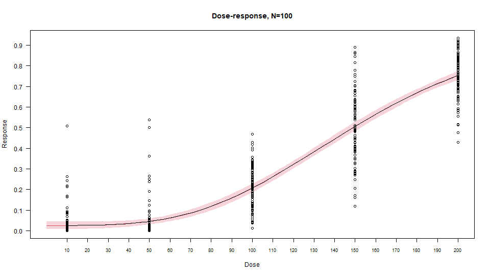

Regression and BMD in toxicology
================
Andreas Sagen
11/03/22

Benchmark dose (BMD) in the field of toxicology is a point of departure
to derive health guidance value such as reference dose (RfD) or
acceptable daily intake (ADI). BMD has become the preferred
dose-response assessment method for regulatory bodies, as it provide
benefits over NOAEL, specifically account for slope of response, account
for non-tested doses, and give incentive to do better tests/studies by
not “rewarding” poor statistical power to bring the threshold values
higher as can be the case with NOAEL.

## Loading R packages

For this guide, two packages are needed. `tidyverse` to import the data
and visual representation, while `drc` is used to build a logistic model
as the base for the BMD model.

``` r
library(readr)
library(drc)
```

## Loading the data

The data is loaded using *read_csv* from `readr`. The dose and response
variable is imported as type double.

``` r
df <- read_csv(
    "data/dose-response.csv",
    col_types = cols(
        Dose = col_double(),
        Response = col_double()
    )
)
```

## Regression

A 4 point sigmoidal log-logistic model is fitted to the dataset.

``` r
df$Response <- df$Response / 100
model <- drm(Response ~ Dose, fct = LL.4(), data = df)
```

## Visualise fit

The model is visualized on the dataset with the model’s confidence
intervals.

``` r
plot(
    model,
    main = "Dose-response, N=100",
    xlab = "Dose",
    ylab = "Response",
    type = "confidence",
    log = "",
    col = c(2, 6)
)
plot(
    model,
    add = TRUE,
    type = "all",
)
axis(
    1,
    xaxp = c(10, 200, 19),
    cex.axis = 0.75,
    las = 1
)
axis(
    2,
    yaxp = c(0.0, 1.0, 10),
    las = 1
)
```



## Find benchmark dose values

From this it is possible to visually deduce that the BMD is approx. 82
by 10% response. The BMDL is 0, indicated by the 10% response lower
confidence interval band.
